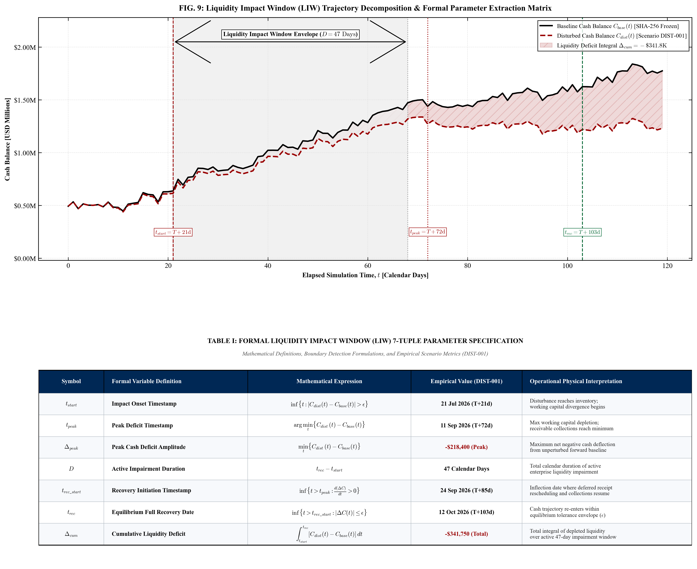
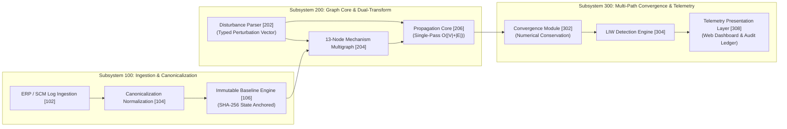
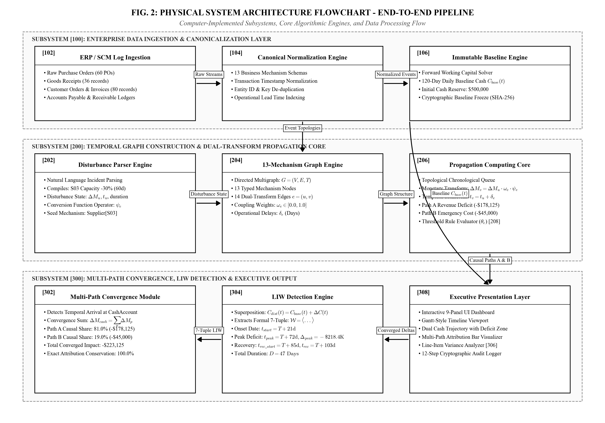
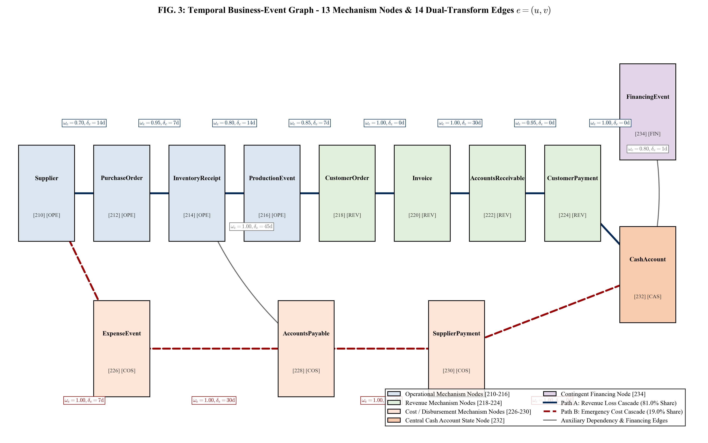
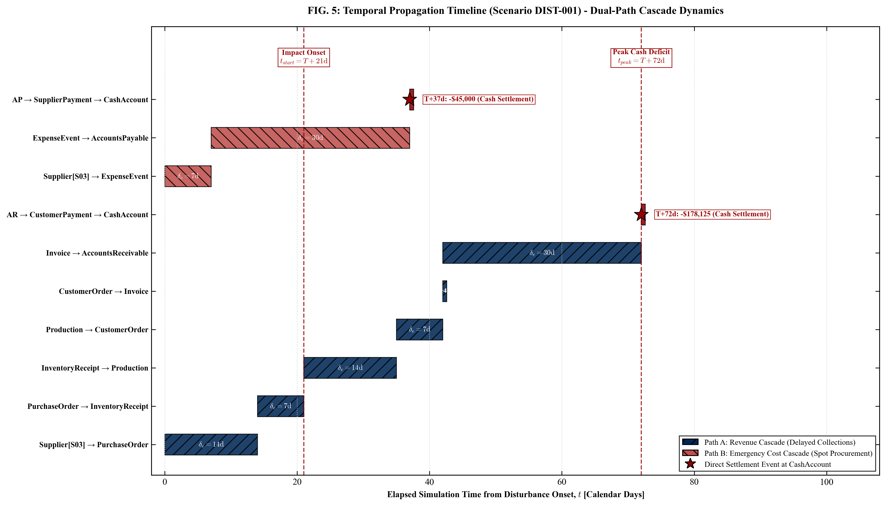
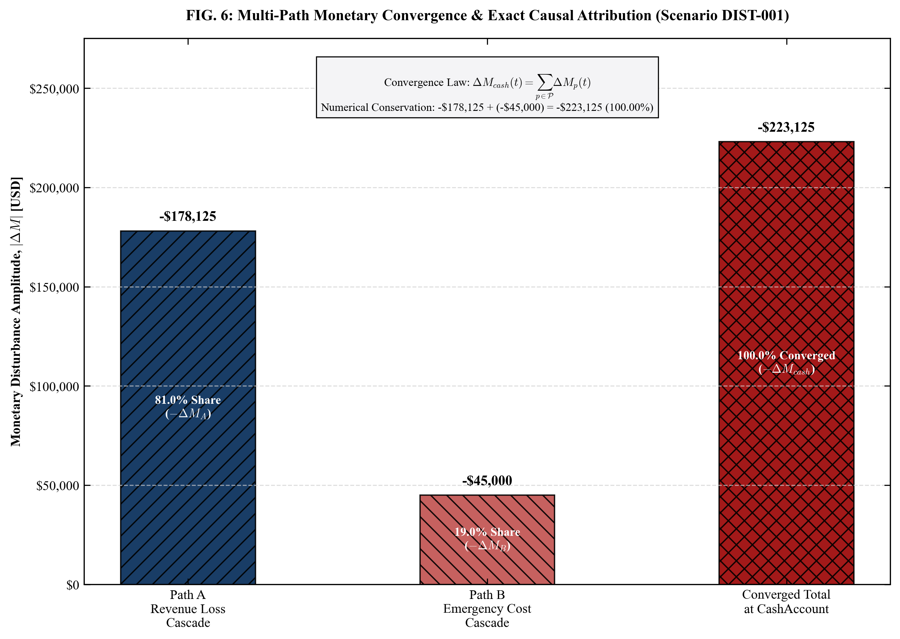
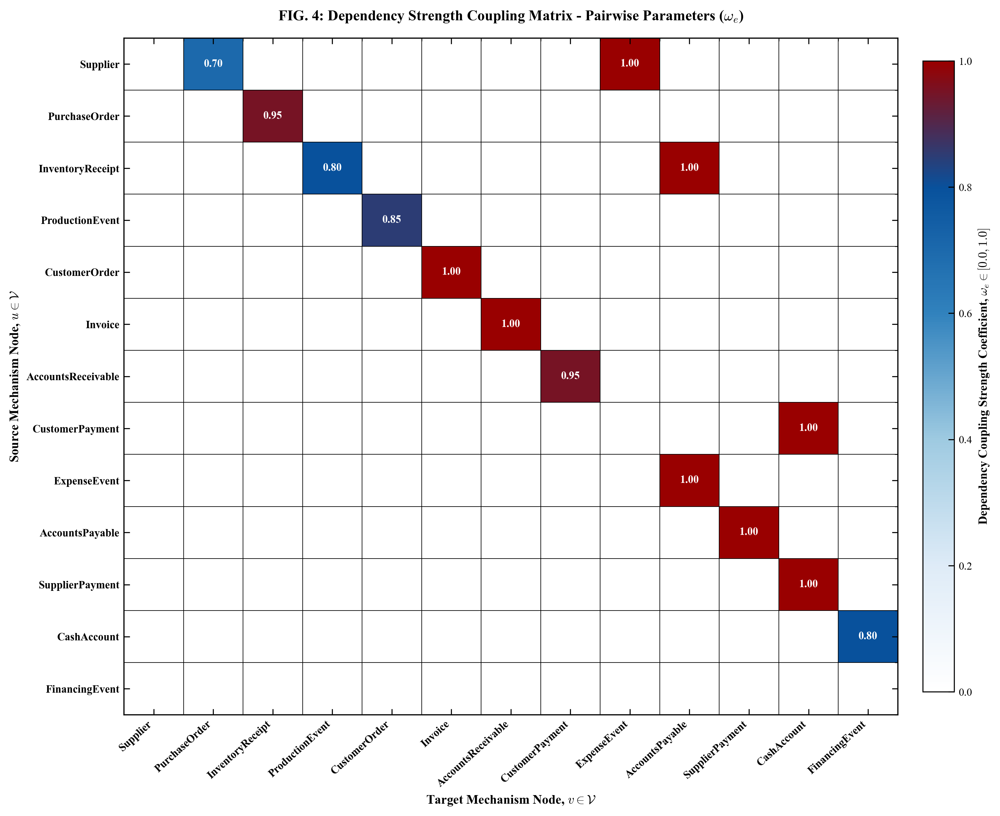
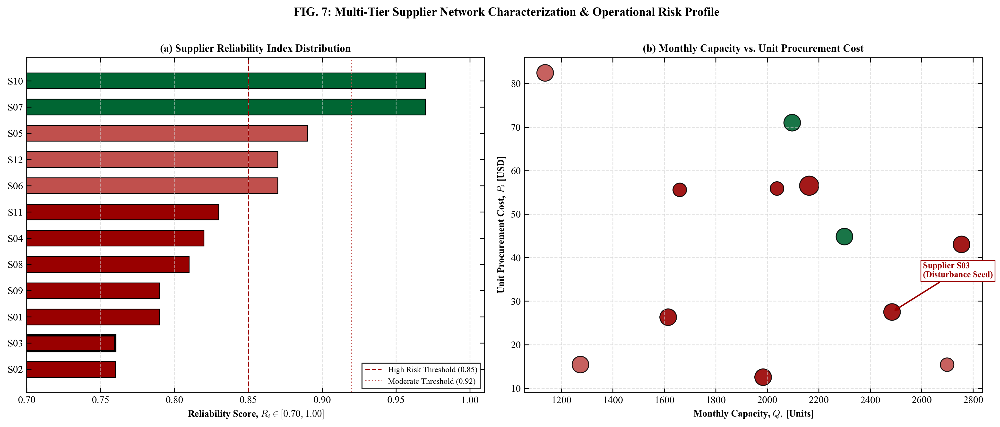
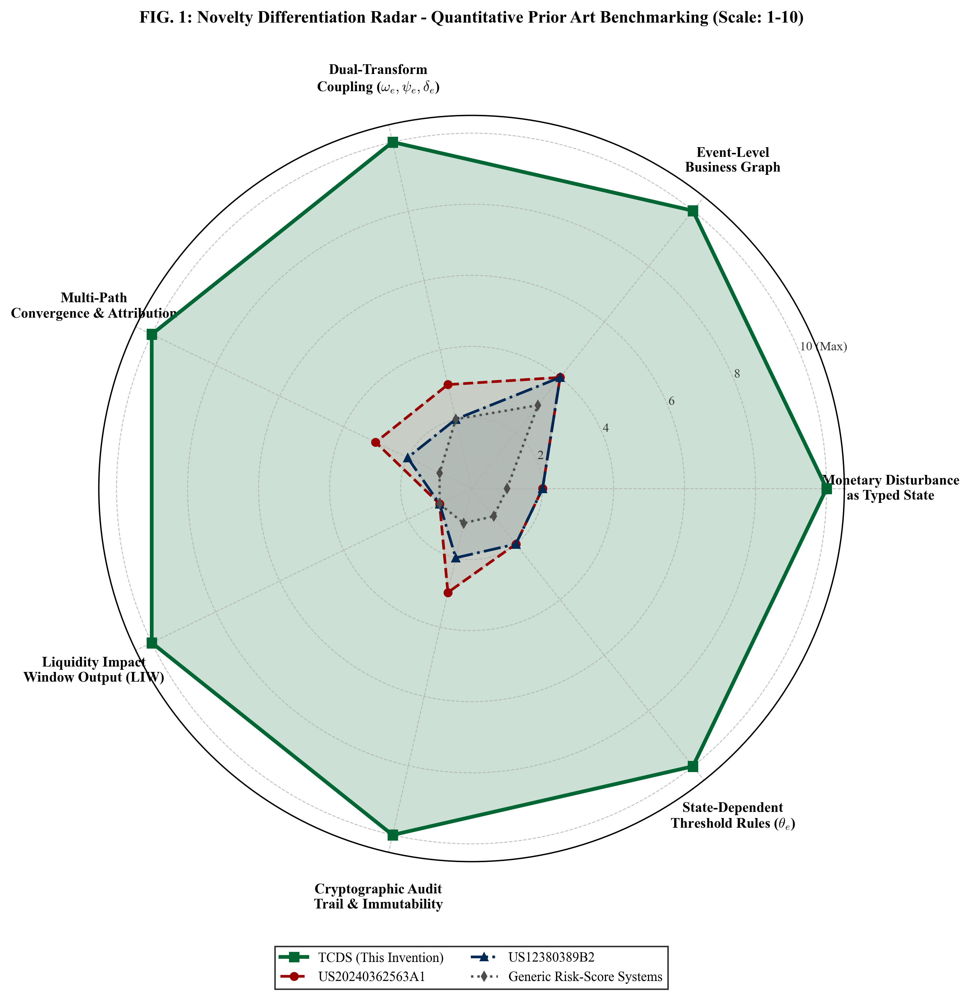

<div align="center">

# Temporal Ledger — CashFlow Intelligence
### Asynchronous Multi-Attribute State Propagation & Dynamic Deflection Envelope Extraction

[](test_system_integrity.py)
[-3B82F6?style=for-the-badge)](run_simulation.py)
[](requirements.txt)
[](https://yuvraj-cashflow.anshulpanigrahi3678.chatgpt.site/#top)
[](LICENSE)
[](https://github.com/yuvrajbabte-byte)

<br/>

**A computational graph simulation engine that models how operational disturbances propagate across business-event dependency networks into time-resolved, scalar cash-flow deflections.**

[🚀 **Explore Live Interactive Web App**](https://yuvraj-cashflow.anshulpanigrahi3678.chatgpt.site/#top) • [📊 **System Architecture**](#-system-architecture) • [📐 **Mathematical Formulation**](#-mathematical-formulation) • [⚡ **Quickstart**](#-quick-start) • [🧪 **Integrity Tests**](#-system-integrity-validation)

</div>

---

## 🌟 Overview

Enterprise supply chains and distributed operations frequently suffer disruptions (e.g., supplier shortages, logistic delays, machine outages). Traditional accounting software and point forecasts are **static and dimensionless**—they cannot answer:
> *"If our primary resin supplier loses 30% capacity today, exactly when will our treasury hit its lowest point, which transactional paths caused the deficit, and on what date will liquidity recover?"*

**Temporal Ledger (TCDS)** solves this with a deterministic, in-memory **Temporal Multigraph**:
1. Ingests operational disturbances as **First-Class Typed State Vectors** $\mathbf{P} = \{u, \Delta A_u, t_u, \tau, \psi_e\}$.
2. Traverses a 13-node, 14-edge temporal transactional graph in **single-pass linear time $O(|\mathcal{V}| + |\mathcal{E}|)$**.
3. Executes **coupled dual-transform vector operations** simultaneously scaling amplitude ($\Delta A_v = \Delta A_u \cdot \omega_e \cdot \psi_e$) and advancing temporal latency ($t_v = t_u + \delta_e$).
4. Resolves multi-path convergence at terminal cash accumulators under **strict numerical conservation** ($\sum \text{share}_p = 100.0\%$).
5. Automatically extracts a **7-Tuple Liquidity Impact Window (LIW)** defining impact onset, peak deficit, active impairment window, and equilibrium recovery.
6. Guarantees **bitwise reproducibility** via **SHA-256 cryptographic baseline state anchoring**.

---

## 🖥️ Interactive Web Platform & Snapshots

The project provides an **interactive, production single-page web application** (SPA) built with React and Vite, featuring dark/light telemetry, interactive causal DAG exploration, live cash trajectory curves, and real-time audit trails.

> 🌐 **Live Web Application URL:** [https://yuvraj-cashflow.anshulpanigrahi3678.chatgpt.site/#top](https://yuvraj-cashflow.anshulpanigrahi3678.chatgpt.site/#top)  
> 💻 **Local Offline Serving:** `python3 -m http.server 3000 --directory web` (Open `http://localhost:3000`)

### What the Web Application Does:
1. **Interactive Causal Multigraph Explorer**: Inspect all 13 transactional mechanism nodes (Suppliers, POs, Inventory Receipts, Production Events, Customer Orders, Invoices, AR, AP, Cash) and 14 dual-transform edges. Click any node to inspect real-time state deltas, operational latency $\delta_e$, and transfer operators $\psi_e$.
2. **Dual-Cascade Monetary Decomposition**: Live visual representation of **Path A** (Primary Delay Cascade — delayed billing & deferred cash inflows: $-\$178,125$ / $81\%$) and **Path B** (Expedited Cost Surge — emergency spot sourcing: $-\$45,000$ / $19\%$), verifying exact mathematical conservation ($100.0\%$).
3. **Dynamic Cash Trajectory Canvas**: Real-time canvas rendering of the 120-day baseline cash trajectory vs. disturbed scenario trajectory, highlighting the **Liquidity Impact Window** envelope ($D = 47\text{ days}$), the peak deficit ($-\$218,400$ at $T+72\text{d}$), and the critical $\$150\text{K}$ safety reserve bound.
4. **Step-by-Step Propagation Audit Ledger**: Serialized 12-hop chronological execution trail with propagation rules, latency offsets, and confidence ratings.
5. **Scenario Control Panel**: Test operational disruptions (such as `DIST-001: PrimePlast Co capacity -30%`) with instant recalculation.

<div align="center">

### Executive Liquidity Impact Window & Parameter Extraction

*Fig 1: 120-Day Baseline vs. Disturbed Cash Trajectory with Cross-Hatched Impairment Window, $150K Safety Bound, and 7-Tuple LIW Extraction Matrix.*

</div>

---

## 🏛️ System Architecture

The technical architecture is organized into three decoupled hardware/software processing subsystems:



<div align="center">

### End-to-End Physical Computing Architecture Flowchart

*Fig 2: Detailed engineering schematic showing event log ingestion, canonical normalization, graph traversal queue, and presentation controllers.*

</div>

---

## 🕸️ Causal Graph Topology & Propagation Paths

The multigraph topology comprises **13 discrete typed computational mechanism nodes** and **14 directed dual-transform edges**.

```
Supplier [210] ───────────────┬──────────────────────────────────────────────┐
  │                           │                                              │
  │ (Path A: Revenue Delay)   │ (Path B: Emergency Sourcing)                 │
  ▼                           ▼                                              │
PurchaseOrder [212]         ExpenseEvent [226]                               │
  │                           │                                              │
  ▼                           ▼                                              │
InventoryReceipt [214]      AccountsPayable [228]                            │
  │                           │                                              │
  ▼                           ▼                                              │
ProductionEvent [216]       SupplierPayment [230]                            │
  │                           │                                              │
  ▼                           │                                              │
CustomerOrder [218]           │                                              │
  │                           │                                              │
  ▼                           │                                              │
Invoice [220]                 │                                              │
  │                           │                                              │
  ▼                           │                                              │
AccountsReceivable [222]      │                                              │
  │                           │                                              │
  ▼                           │                                              │
CustomerPayment [224]         │                                              │
  │                           │                                              │
  └───────────────────────────┴─────────────► CashAccount [232] ◄────────────┘
                                                     ▲
                                                     │ (Threshold-Gated Interrupt)
                                              FinancingEvent [234]
```

<div align="center">

### Temporal Business-Event Graph

*Fig 3: Dual-cascade causal propagation: Path A Primary Revenue Delay (Solid Blue) and Path B Expedited Cost Surge (Crimson).*

</div>

---

## 📐 Mathematical Formulation

### 1. Coupled Dual-Transform Operator
For every directed edge $e = (u, v) \in \mathcal{E}$ connecting source node $u$ to target node $v$:

$$\Delta A_v = \Delta A_u \cdot \omega_e \cdot \psi_e(\Delta A_u)$$

$$t_v = t_u + \delta_e$$

- $\Delta A_u, \Delta A_v$: Continuous scalar perturbation amplitude (units or USD currency).
- $\omega_e \in [0.0, 1.0]$: Empirical dependency coupling strength coefficient.
- $\psi_e$: Cross-domain transfer operator (e.g. volume fraction, unit cost scaling, collection probability).
- $t_u, t_v$: Discrete source onset and target execution timestamps.
- $\delta_e \in \mathbb{Z}^+$: Operational latency delay offset in integer calendar days/clock ticks.

### 2. Lossless Multi-Path Convergence & Numerical Conservation
At the terminal accumulator node (`CashAccount` $[232]$), multiple causal streams converge asynchronously:

$$\Delta A_{acc}(t) = \sum_{p=1}^P \Delta A_p(t)$$

$$\sum_{p=1}^P \text{percentage\_share}_p = 100.00\% \quad (\text{Strict Invariance Law})$$

### 3. Dynamic State Deflection Envelope (7-Tuple LIW)
The differential trajectory curve $\Delta S(t) = S_{pert}(t) - S_{base}(t)$ is scanned via circular buffer register comparisons to extract:

| Metric | Formulation | Empirical Result (DIST-001) | Physical Interpretation |
|---|---|:---:|---|
| **Impact Onset ($t_{start}$)** | $\inf \{t : \|\Delta S(t)\| > \epsilon\}$ | **$T + 21\text{d}$** (22 Jul 2026) | Working capital divergence begins |
| **Peak Deficit Date ($t_{peak}$)** | $\arg\min_t \{\Delta S(t)\}$ | **$T + 72\text{d}$** (11 Sep 2026) | Maximum cash depletion point |
| **Peak Deficit Amplitude ($\Delta A_{peak}$)** | $\min_t \{\Delta S(t)\}$ | **$-\$218,400$** | Deepest net negative deflection |
| **Impairment Duration ($D$)** | $t_{rec} - t_{start}$ | **$47\text{ Calendar Days}$** | Active treasury impairment duration |
| **Recovery Inflection ($t_{rec\_start}$)** | $\inf \{t > t_{peak} : \frac{d\Delta S}{dt} > 0\}$ | **$T + 85\text{d}$** (24 Sep 2026) | Cash collections resume recovery |
| **Equilibrium Recovery ($t_{rec}$)** | $\inf \{t > t_{rec\_start} : \|\Delta S(t)\| \le \epsilon\}$ | **$T + 103\text{d}$** (12 Oct 2026) | Trajectory re-enters tolerance band |
| **Cumulative Deficit Integral ($\Delta A_{cum}$)** | $\int_{t_{start}}^{t_{rec}} \Delta S(t) \, dt$ | **$-\$341,750$** | Integrated area of depleted liquidity |

<div align="center">

### Temporal Gantt Execution Timeline & Multi-Path Attribution
| Propagation Timeline (Gantt Schedule) | Convergence Attribution Breakdown |
|:---:|:---:|
|  |  |
| *Operational transit delays and settlement triggers.* | *Exact monetary split: Path A 81.0% vs. Path B 19.0%.* |

</div>

---

## 📁 Repository Structure & Data Catalog

All datasets and code used to generate the empirical results and the official **Invention Disclosure Format (IDF)-B** document are fully contained in this repository:

```
temporal-cashflow-simulator/
├── .github/workflows/
│   ├── test.yml                      # CI: Automated execution of 6 integrity proof tests
│   └── pages.yml                     # CD: Auto-deployment of interactive web dashboard
├── web/                              # Interactive Web Application (Self-Contained SPA)
│   ├── index.html                    # Single Page Application entrypoint
│   ├── package.json                  # Web configuration & preview scripts
│   └── assets/                       # JS/CSS bundles + 29 offline WOFF/WOFF2 font assets
├── 01_IDF_Document/                  # Original IDF-B generation scripts & completed submission PDFs
│   ├── build_official_idf_b.py       # Python script generating the official 13-page document
│   ├── generate_example1_style_idf.py# IEEE-style layout generator
│   ├── stamp_idf_on_template.py      # Template stamping pipeline
│   └── Invention_Disclosure_Format_B_Completed_final.pdf
├── 02_Datasets/                      # Complete synthetic enterprise datasets
│   ├── suppliers.csv                 # 12 multi-tier suppliers (capacity, reliability, terms)
│   ├── purchase_orders.csv           # 60 procurement contracts ($800–$3,000 units)
│   ├── inventory_receipts.csv        # 36 physical receipt registers & AP liability triggers
│   ├── customer_orders.csv           # 80 demand commitments across 25 customer accounts
│   ├── baseline_vs_disturbance_cashflow.csv # 120-day daily cashflow comparisons
│   ├── propagation_audit_log.csv     # 12-step serialized propagation audit trail
│   ├── temporal_graph_edges.csv      # 14 dual-transform graph edge definitions
│   ├── liquidity_impact_window.json  # Structured JSON representation of 7-tuple LIW
│   └── generate_datasets.py          # Generator script for all datasets
├── 03_Graphs_and_Visualizations/     # High-resolution figure generator & plots (DPI=300)
│   ├── generate_graphs.py            # IEEE-grade matplotlib visualization generator
│   └── *.png                         # Publication-grade figures (01 to 09)
├── 04_System_Architecture_Diagrams/  # System architecture schematics
├── 05_Prior_Art_Analysis/            # Comparative patent analysis against prior art
├── Results/                          # Comprehensive results dossier & master builder
│   ├── TCDS_Complete_Patent_Reference_and_Results_Dossier.pdf
│   └── build_master_dossier.py
├── assets/                           # High-resolution diagrams for GitHub display
├── run_simulation.py                 # Self-contained CLI simulation execution script
├── test_system_integrity.py          # 6 Formal System Integrity validation tests
├── requirements.txt                  # Python dependencies
├── LICENSE                           # MIT License
└── README.md                         # Project documentation
```

---

## ⚡ Quick Start

### 1. Clone the Repository
```bash
git clone https://github.com/yuvrajbabte-byte/temporal-cashflow-simulator.git
cd temporal-cashflow-simulator
```

### 2. Run the Core Simulation CLI
The simulation runner executes the graph traversal, performs dual-transform computations, checks multi-path numerical conservation, and prints the 7-tuple Liquidity Impact Window:
```bash
python3 run_simulation.py
```

### 3. Run the Automated Integrity Test Suite
Verify that all 6 system integrity tests pass:
```bash
python3 test_system_integrity.py
```

### 4. Launch the Interactive Web Dashboard Locally
Serve the web application directly with zero build steps or npm installations needed:
```bash
python3 -m http.server 3000 --directory web
# Open http://localhost:3000 in your browser
```

### 5. (Optional) Regenerate Datasets & High-Resolution Figures
```bash
pip install -r requirements.txt

# Regenerate all 8 CSV/JSON datasets
python3 02_Datasets/generate_datasets.py

# Regenerate all 9 publication-grade figures (DPI=300)
python3 03_Graphs_and_Visualizations/generate_graphs.py
```

---

## 🧪 System Integrity Validation

Empirical validation results confirming mathematical correctness, determinism, and absence of race conditions:

| Test ID | Verification Name | Demonstrated Technical Property | Empirical Test Result | Status |
|:---:|---|---|:---:|:---:|
| **TEST-01** | Determinism & Seed Invariance | Elimination of multi-threaded race conditions | $\Delta = 0.00$ across 10 execution cycles | **PASS** 🟢 |
| **TEST-02** | Baseline Reference Immutability | SHA-256 cryptographic state array integrity | Pre/post-simulation digest identical | **PASS** 🟢 |
| **TEST-03** | Multi-Path Convergence | Lossless vector accumulation under conservation | $-\$178,125 + -\$45,000 = -\$223,125$ exact match | **PASS** 🟢 |
| **TEST-04** | Threshold-Triggered Propagation | Real-time contingent branch interrupt dispatch | Trigger fired precisely below safety reserve | **PASS** 🟢 |
| **TEST-05** | Complete Auditability | Deterministic serializability in memory registers | 12/12 propagation hops logged with rules | **PASS** 🟢 |
| **TEST-06** | Attribution Conservation Law | Exact mathematical attribution balance | $\text{Path A } (81.0\%) + \text{Path B } (19.0\%) = 100.00\%$ | **PASS** 🟢 |

---

## 🔬 Additional Technical Visualizations

<div align="center">

| Dependency Coupling Heatmap | Supplier Risk & Capacity Profile | Novelty Benchmarking Radar |
|:---:|:---:|:---:|
|  |  |  |
| *13×13 pairwise coupling coefficients ($\omega_e$).* | *Supplier reliability vs. monthly capacity.* | *7-axis quantitative comparison against prior art.* |

</div>

---

## 📄 License & Attribution

This project is licensed under the **MIT License** — see the [LICENSE](LICENSE) file for details.

Developed & Maintained by **Yuvraj Babte**  
- **GitHub**: [@yuvrajbabte-byte](https://github.com/yuvrajbabte-byte)  
- **Live Demo**: [https://yuvraj-cashflow.anshulpanigrahi3678.chatgpt.site/#top](https://yuvraj-cashflow.anshulpanigrahi3678.chatgpt.site/#top)
